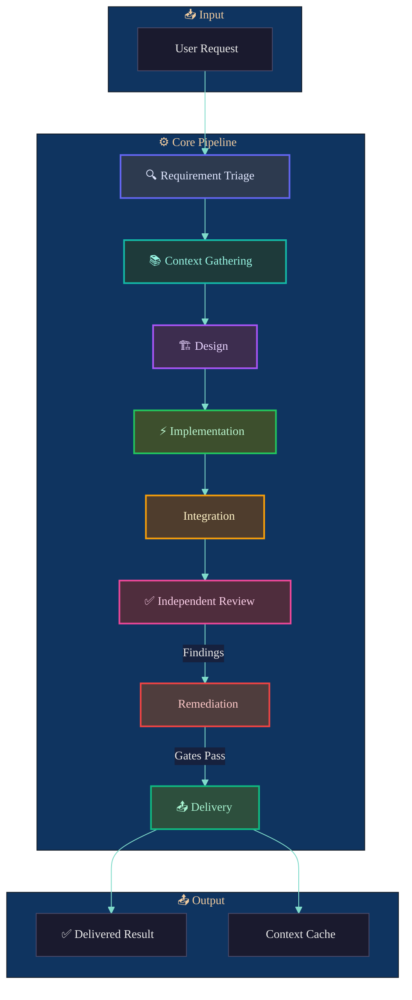
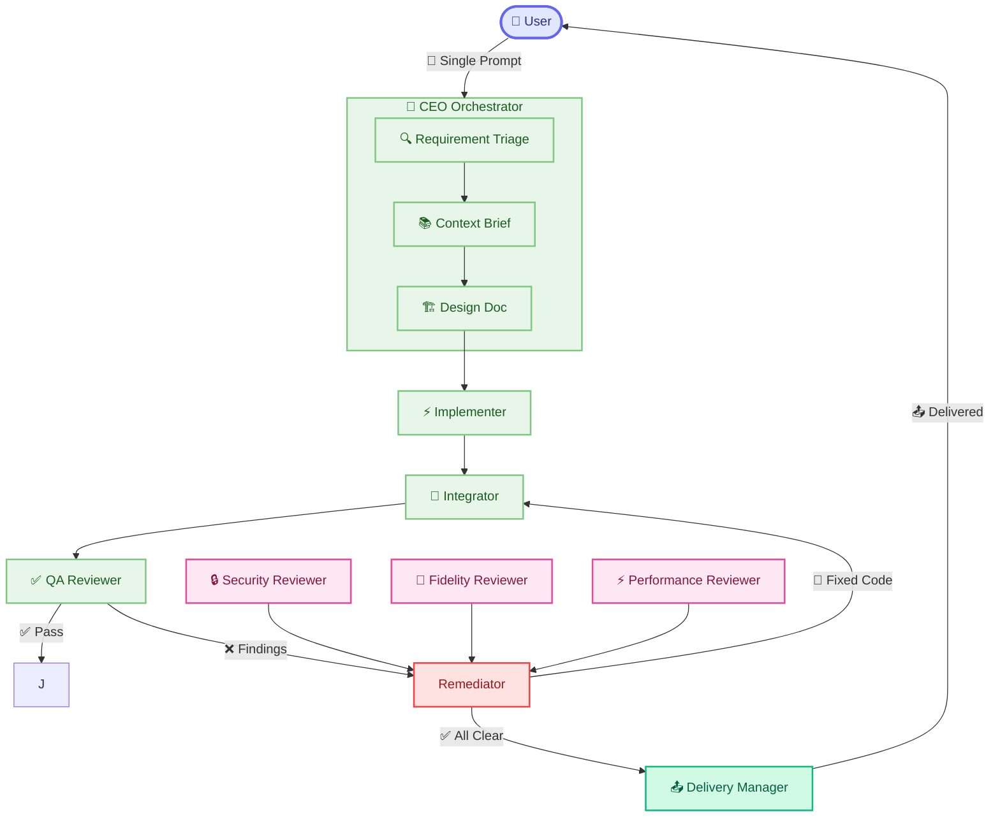

# Kilocode Agents v4 — Context Engineering Architecture

## Motivation

v3 improved over ad-hoc single-agent workflows by introducing explicit pipeline stages and review quorums. However, it still relies primarily on **prompt engineering** — optimizing the instruction template — rather than engineering the **context** that goes into the template.

The problem: a well-engineered prompt with the wrong or poorly-gathered context still produces wrong results. The context is the what and when; the prompt is the how.

## Core Principles for v4

### 1. Context is First-Class
Every task starts with context gathering, not prompt writing. The pipeline treats context engineering as a distinct phase with dedicated tooling.

### 2. Separation of Concern
- **Context Engineer**: gathers and synthesizes what's relevant
- **Architect**: designs the solution given the gathered context
- **Implementer**: executes within the designed context
- **Reviewer**: independently verifies against source-of-truth

### 3. Transparent Review Workflows
Every significant decision passes through visible review with explicit approval gates. No black-box autonomous decisions.

### 4. End-to-End Lifecycle
From requirement -> context -> design -> implementation -> verification -> delivery, with explicit checkpoints and remediation loops.

### 5. Dynamic Context Narrowing
Context is dynamically filtered based on what's relevant for the current stage, not dumped all at once. Each pipeline stage receives only the context it needs.

---

## Pipeline Overview



### Pipeline Flow

| Stage | Agent | Output | Gate |
|-------|-------|--------|------|
| 0. Triage | `requirement-triage` | Classification: TRIVIAL / BOUNDED / COMPLEX | — |
| 1. Context | `context-engineer` | Context Brief | — |
| 2. Design | `solutions-architect` | Design Document (COMPLEX) / Plan | Review for COMPLEX |
| 3. Implement | `implementer` | Code + Verification | — |
| 4. Integrate | `integrator` | Connected Slices | — |
| 5. Review | QA / Fidelity / Security / Performance | Findings Report | Block on HIGH |
| 6. Remediate | `remediator` | Fixed Code | Loop until CLEAR |
| 7. Deliver | `delivery-manager` | Accepted Result | — |

---

## Per-Agent Pipeline



### Data Flow

- **Green nodes** — core pipeline stages
- **Pink nodes** — review agents
- **Red node** — remediation loop
- **Teal node** — final delivery

The user sends a **single prompt** to `ceo`. `ceo` orchestrates the entire pipeline, delegating to specialists and reviewers as needed, with explicit remediation loops until all gates pass.

---

## v4 Pipeline Stages

### Stage 0: Requirement Triage
**Agent**: `requirement-triage`
- Classifies task as TRIVIAL / BOUNDED / COMPLEX
- Determines required pipeline depth based on risk classification
- Sets context quality bar: what additional context is needed before proceeding

### Stage 1: Context Gathering
**Agent**: `context-engineer`
- Gathers relevant context from:
  - Repo structure and conventions (via `repo-explorer`)
  - Existing documentation, specs, requirements
  - Relevant code, APIs, patterns
  - External knowledge (web fetch for libraries, docs)
  - Git history for similar changes
- Synthesizes context into a **Context Brief** — a focused, stage-specific document that narrows what matters

### Stage 2: Design
**Agent**: `solutions-architect`
- Translates the Context Brief + user request into a concrete technical plan
- Defines file-by-file change scope
- Identifies invariants, constraints, failure modes
- For COMPLEX tasks, creates a **Design Document** reviewed by `scrum-master` and `product-manager`

### Stage 3: Implementation
**Agent**: `implementer`
- Takes the Design Document + Context Brief
- Implements in atomic, verifiable slices
- Each slice produces: code change + verification evidence + residual risk notes

### Stage 4: Integration
**Agent**: `integrator`
- Connects slices together
- Checks cross-file consistency, imports, interfaces
- Applies review findings with minimal blast radius

### Stage 5: Independent Review
- **`qa-reviewer`**: correctness, regressions, business logic gaps
- **`fidelity-reviewer`**: exactness against source-of-truth when fidelity-sensitive
- **`security-reviewer`**: trust-boundary changes
- **`performance-reviewer`**: performance constraints, concurrency, memory safety

### Stage 6: Remediation
**Agent**: `remediator`
- Addresses review findings
- Re-runs verification
- Ensures every gate passes before advancing

### Stage 7: Delivery
**Agent**: `delivery-manager`
- Confirms all acceptance criteria met
- Cleans up temporary artifacts
- Updates context cache for future work on same repo

---

## New Agent Definitions

### Core Orchestrators

#### `ceo` (enhanced)
Primary orchestrator. Entry point for all tasks. Routes to appropriate pipeline stage based on triage. Maintains todo state and continuity summaries.

#### `requirement-triage` (NEW)
Classifies the incoming task and determines pipeline depth.

#### `context-engineer` (NEW)
Gathers, synthesizes, and narrows context. Produces a Context Brief. This replaces ad-hoc "inspect repo" steps with structured context engineering.

#### `solutions-architect` (replaces `architect`)
Enhanced from v3. Works from Context Brief, not raw user request. Produces Design Document for COMPLEX tasks, directly actionable plan for BOUNDED.

### Specialist Agents

#### `implementer` (replaces `lead-engineer`)
Takes Design Document + Context Brief, implements in verifiable slices.

#### `integrator` (replaces `integration-engineer`)
Connects slices, applies review fixes, guards cross-file consistency.

#### `remediator` (NEW)
Handles remediation loops after review findings. Replaces ad-hoc remediation loops previously embedded in `ceo`.

#### `delivery-manager` (NEW)
Final verification, artifact cleanup, acceptance confirmation.

### Review Agents

#### `qa-reviewer` (enhanced)
Now operates on Context Brief + Design Document, not just code diff.

#### `fidelity-reviewer`
Checks against source-of-truth: spec, UI, protocol, algorithm, expected output.

#### `security-reviewer`
Trust-boundary changes.

#### `performance-reviewer` (NEW)
Concurrency, memory, resource constraints for structural changes.

### Support Agents

#### `scrum-master` (enhanced)
Now works from triage classification + context, not just user request.

#### `product-manager` (enhanced)
Context-aware requirement analysis.

#### `repo-explorer`
Now feeds into context-engineer as a context source.

---

## File Structure for v4

```
v4/
├── agents.json                  # Full config bundle
├── agent-imports/
│   ├── ceo.agent.json
│   ├── requirement-triage.agent.json
│   ├── context-engineer.agent.json
│   ├── solutions-architect.agent.json
│   ├── implementer.agent.json
│   ├── integrator.agent.json
│   ├── remediator.agent.json
│   ├── delivery-manager.agent.json
│   ├── qa-reviewer.agent.json
│   ├── fidelity-reviewer.agent.json
│   ├── security-reviewer.agent.json
│   ├── performance-reviewer.agent.json
│   ├── scrum-master.agent.json
│   ├── product-manager.agent.json
│   └── repo-explorer.agent.json
├── context/
│   ├── context-brief-template.md
│   └── design-doc-template.md
└── README.md
```

---

## Key Improvements Over v3

| Aspect | v3 | v4 |
|--------|----|----|
| Context | Ad-hoc, prompt-dumped | Engineered, synthesized, narrowed |
| Triage | Implicit in `ceo` | Dedicated `requirement-triage` agent |
| Design | Single `architect` | `solutions-architect` with context-aware design |
| Implementation | `lead-engineer` scoped by task | `implementer` scoped by Design Document |
| Review | Post-hoc, code-only | Throughout, context-aware, multi-track |
| Remediation | Implicit loops in `ceo` | Dedicated `remediator` |
| Delivery | End of `ceo` turn | Explicit `delivery-manager` |
| Performance | Absent | `performance-reviewer` for structural changes |
| Continuity | Todos only | Context cache + resumable summaries |

---

## Usage

A single prompt to `ceo` triggers:

1. `requirement-triage` → classify task
2. `context-engineer` → produce Context Brief
3. `solutions-architect` → produce Design Document (for COMPLEX)
4. `implementer` → implement slices
5. `integrator` → connect slices
6. Review queue → (QA, fidelity, security, performance as needed)
7. `remediator` → fix findings
8. `delivery-manager` → final verification

The user interacts only with `ceo`. All other agents are orchestrated behind the scenes.

---

## License

Same as v3 — CC BY 4.0 for prompts, Apache-2.0 for code/config. See [LICENSE](./LICENSE).